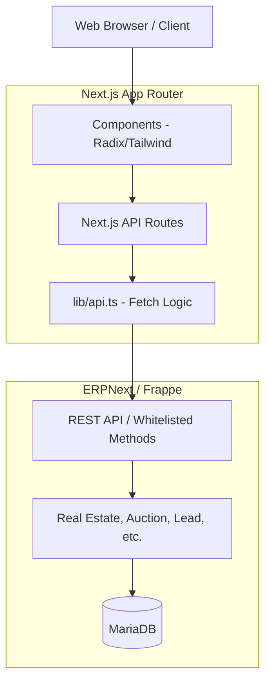
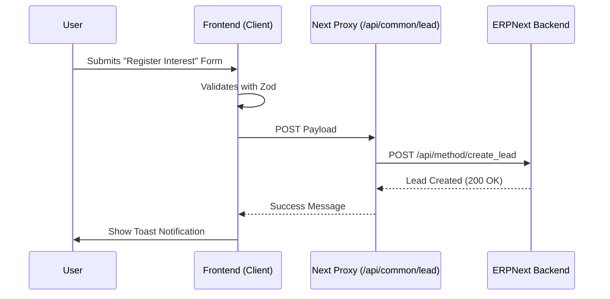

# Amaken Unified Website - Team Guide

Welcome to the **Amaken Unified Website** project. This document serves as the primary technical guide for all team members. It covers the system architecture, folder structure, development workflows, and integration with ERPNext.

---

## 🚀 Quick Start

### 1. Prerequisites
- **Node.js**: 18.x or higher
- **Package Manager**: `npm` (standard)

### 2. Setup
```bash
# Clone the repository
git clone <repo-url>
cd amaken-site

# Install dependencies
npm install

# Configure environment
cp .env.example .env.local
# Fill in ERPNext credentials in .env.local
```

### 3. Development
```bash
npm run dev
```
Visit [http://localhost:3000](http://localhost:3000).

---

## 🏗️ System Architecture

The application follows a **Decoupled Headless CMS** pattern where Next.js acts as the frontend "Head" for the **ERPNext (Frappe)** backend.

### High-Level Flow


---

## 📁 Folder Structure Breakdown

| Directory | Description |
|-----------|-------------|
| `app/` | **Next.js App Router**. Defines all routes and API endpoints. |
| `app/group/` | Core business logic for Projects, Units, and Auctions. |
| `app/api/` | Internal API handlers that proxy requests to ERPNext. |
| `components/` | React components grouped by feature (group, layout, ui). |
| `components/ui/` | Reusable base components (shadcn/ui). |
| `lib/` | Shared utilities, API client (`lib/api.ts`), and i18n logic. |
| `types/` | TypeScript interfaces for Domain Models (Project, Unit, Auction). |
| `hooks/` | Custom React hooks (e.g., `use-toast`, `use-mobile`). |
| `public/` | Static assets (images, fonts). |

---

## 🛠️ Key Modules & Features

### 1. Group Module (`app/group`)
Handles the primary real estate display:
- **Projects**: Listing and detail pages for real estate developments.
- **Units**: Individual properties within projects.
- **Auctions**: Real-time property auction listing and details.

### 2. Lead Generation Flow
Captured via modals (e.g., `InterestModal.tsx`) and sent to ERPNext.



---

## 🔄 Redundant Actions (Developer Cheat Sheet)

These are the most common tasks you will perform. Follow these patterns to maintain consistency:

### 1. Adding a New Page
1. Create a folder in `app/` with a `page.tsx`.
2. If it's a sub-page of a division, place it in `app/group/`, `app/real-estate/`, etc.
3. Update the navigation menu in `components/layout/Navbar`.

### 2. Fetching Data from ERPNext
1. **Define the Type**: Add the interface in `types/`.
2. **Create API Proxy**: Add a route in `app/api/group/` to handle the request securely.
3. **Use Fetch**: In your component, fetch from the internal `/api/...` endpoint.
   > [!TIP]
   > Use server-side fetching in `page.tsx` whenever possible for SEO.

### 3. Adding Translations (i18n)
1. Open `lib/i18n/dictionaries.ts`.
2. Add your key-value pairs in both `en` and `ar`.
3. Use the `t` function in your component:
   ```tsx
   const { t } = useI18n();
   <span>{t("common.submit")}</span>
   ```

### 4. Styling Components
- Use **Tailwind CSS** utility classes.
- For complex variants, use `cva` (Class Variance Authority) as seen in `components/ui/`.
- Ensure **RTL support** by using logical properties (e.g., `ps-4` instead of `pl-4`).

---

## 🔗 Environment Variables

| Variable | Required | Description |
|----------|----------|-------------|
| `NEXT_PUBLIC_ERPNEXT_URL` | Yes | The base URL of the ERPNext instance. |
| `ERP_API_KEY` | Yes | API Key for authenticating with Frappe. |
| `ERP_API_SECRET` | Yes | API Secret for authenticating with Frappe. |

---

## 🤝 Development Standards

- **Git**: Use descriptive feature branches (`feat/`, `fix/`).
- **Commits**: Follow [Conventional Commits](https://www.conventionalcommits.org/).
- **Types**: No `any`. Use the shared types in `types/`.
- **Formatting**: Linter will run on build; ensure `npm run lint` passes.

---

**Built by the Amaken Engineering Team.**
For support, contact the system administrator.
