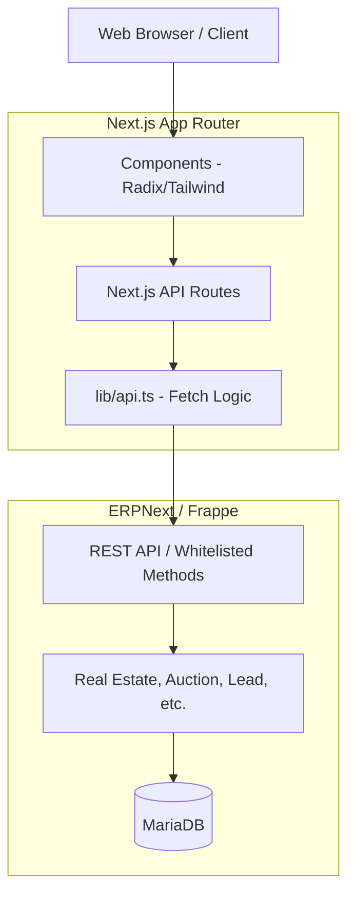
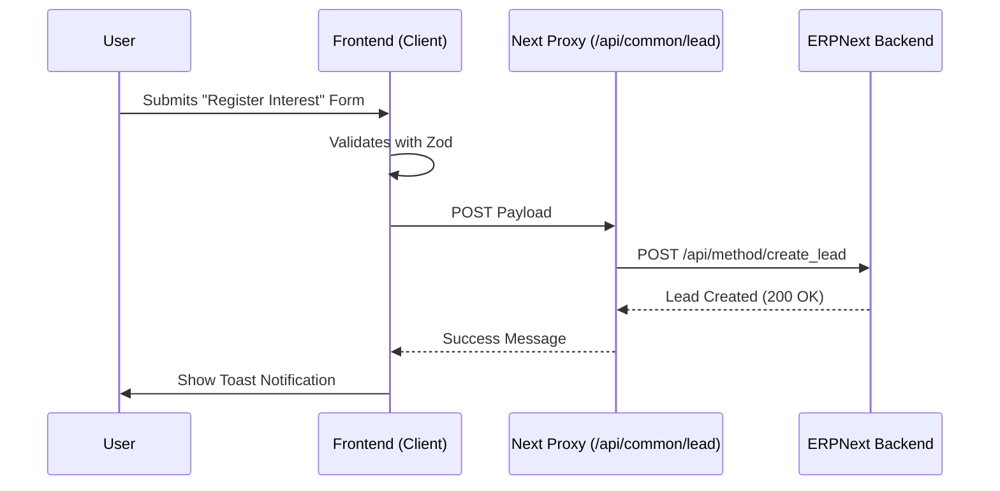
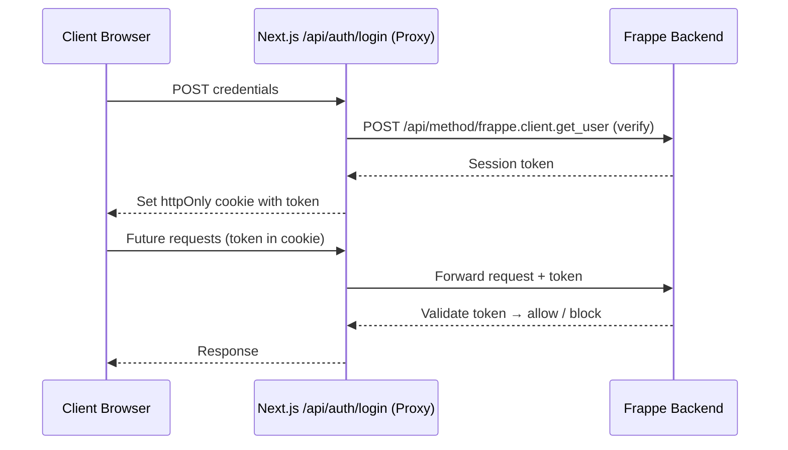

# Amaken Unified Website

The official web platform for **Amaken**, built with **Next.js 16** and backed by **ERPNext (Frappe)**. The application spans three core business divisions—Real Estate Group, Appraisal Services, and Consultation—with a unified design system powered by Tailwind CSS 4, Radix UI, and Framer Motion.

---

## 🚀 Quick Start

### Prerequisites
- **Node.js** 18.x or higher
- **npm** (standard package manager)

### Setup
```bash
# Clone the repository
git clone <repo-url>
cd amaken-site

# Install dependencies
npm install

# Configure environment
cp .env.example .env.local
# Fill in ERPNext credentials in .env.local
```

### Development
```bash
npm run dev
```
Visit [http://localhost:3000](http://localhost:3000).

### Available Scripts
| Script | Description |
|--------|-------------|
| `npm run dev` | Start development server |
| `npm run build` | Create production build |
| `npm run start` | Run production server |
| `npm run lint` | Run ESLint checks |

---

## 🏗️ System Architecture

The application follows a **Decoupled Headless CMS** pattern where Next.js acts as the frontend "Head" for the **ERPNext (Frappe)** backend.

### High-Level Flow


---

## ⚙️ Tech Stack

| Category | Technologies |
|----------|-------------|
| **Framework** | Next.js 16 (App Router) |
| **Language** | TypeScript 5.9 |
| **UI** | React 19, Radix UI, shadcn/ui |
| **Styling** | Tailwind CSS 4, `class-variance-authority`, `tailwind-merge` |
| **Animation** | Framer Motion 12 |
| **Forms** | React Hook Form 7, Zod validation |
| **Charts** | Recharts 2 |
| **Backend Integration** | ERPNext / Frappe (via `frappe-react-sdk`) |
| **Monitoring** | Datadog Browser Logs, Vercel Analytics |
| **Theme** | `next-themes` (dark/light mode) |
| **i18n** | Custom bilingual system (Arabic & English) |

---

## 📁 Project Structure

```
amaken-site/
├── app/                        # Next.js App Router (routes & API)
│   ├── page.tsx                # Landing page
│   ├── layout.tsx              # Root layout (providers, fonts, i18n)
│   ├── globals.css             # Global CSS & Tailwind imports
│   ├── api/                    # 🔒 Internal API proxy layer
│   │   ├── auth/               #    Authentication endpoints
│   │   ├── common/lead/        #    Lead creation (CRM integration)
│   │   ├── group/              #    Projects, Auctions, Misc. Units
│   │   ├── me/                 #    Authenticated user profile
│   │   └── real-estate/        #    Real estate data
│   ├── group/                  # 🏢 Real Estate Group division
│   │   ├── projects/           #    Project listing & detail pages
│   │   ├── auctions/           #    Auction listing & detail pages
│   │   ├── miscellaneous-units/#    Miscellaneous real estate units
│   │   ├── real-estate/        #    Real estate showcase
│   │   ├── services/           #    Group services pages
│   │   ├── about/              #    About the Group
│   │   └── contact/            #    Contact page
│   ├── appraisal/              # 📊 Appraisal Services division
│   │   ├── about-us/           #    About appraisal division
│   │   ├── sample-reports/     #    Sample appraisal reports
│   │   ├── request-appraisal-form/ # Appraisal request form
│   │   ├── request-detail-page/#    Request details view
│   │   ├── service-detail/     #    Individual service info
│   │   ├── blog-insights/      #    Blog & industry insights
│   │   ├── client-dashboard/   #    Authenticated client area
│   │   ├── login-register/     #    Appraisal auth pages
│   │   └── contact-us/         #    Appraisal contact page
│   ├── consultation/           # 💼 Consultation division
│   │   ├── about/              #    About consultation division
│   │   ├── services/           #    Consultation services
│   │   ├── feasibility/        #    Feasibility studies
│   │   └── highest-best-use/   #    Highest & best use analysis
│   └── portal/                 # 🔑 User authentication portal
│       ├── login/              #    Login page
│       ├── register/           #    Registration page
│       └── forget-password/    #    Password recovery
├── components/                 # React components by feature
│   ├── layout/                 #    Navbar, Header, Footer, Breadcrumb
│   ├── ui/                     #    shadcn/ui base components (65 files)
│   ├── group/                  #    Group-specific components
│   ├── appraisal/              #    Appraisal-specific components
│   ├── consultation/           #    Consultation-specific components
│   ├── about/                  #    About page components
│   ├── contact/                #    Contact page components
│   ├── real-estate/            #    Real estate components
│   └── shared/                 #    Cross-division shared components
├── lib/                        # Shared utilities
│   ├── api.ts                  #    ERPNext API client (fetch wrapper)
│   ├── utils.ts                #    General utility functions
│   ├── auth-context.tsx        #    Authentication context provider
│   ├── auth/                   #    Auth helpers
│   └── i18n/                   #    Internationalization (AR/EN)
├── types/                      # TypeScript domain models
│   ├── auction.ts              #    Auction interface
│   ├── ProjectData.ts          #    Project interface
│   ├── UnitData.ts             #    Unit interface
│   └── AcutionsResponse.ts     #    API response types
├── hooks/                      # Custom React hooks
│   ├── use-countdown.ts        #    Auction countdown timer
│   ├── use-mobile.ts           #    Mobile viewport detection
│   └── use-toast.ts            #    Toast notification system
├── styles/                     # Additional stylesheets
│   └── globals.css             #    Extended global styles
└── public/                     # Static assets (images, fonts)
```

---

## 🛠️ Key Modules & Features

### 1. Group Module (`app/group`)
The primary real estate division:
- **Projects** — Listing and detail pages for real estate developments.
- **Auctions** — Live property auction listing with countdown timers, brochure downloads, and YouTube video embedding.
- **Miscellaneous Units** — Standalone real estate units not bound to a project.
- **Real Estate** — General real estate showcase.
- **Services** — Division-specific service pages.

### 2. Appraisal Module (`app/appraisal`)
Property appraisal and valuation services:
- **Appraisal Requests** — Form-based submission with detail tracking.
- **Sample Reports** — Showcase of appraisal report formats.
- **Client Dashboard** — Authenticated area for clients to track requests.
- **Blog & Insights** — Industry articles and market updates.

### 3. Consultation Module (`app/consultation`)
Advisory and feasibility services:
- **Feasibility Studies** — Detailed feasibility analysis services.
- **Highest & Best Use** — Land use optimization analysis.

### 4. Lead Generation Flow
Captured via modals (e.g., `InterestModal.tsx`) and sent to ERPNext CRM.



### 5. Authentication (`app/portal`)
User portal with login, registration, and password recovery, integrated with ERPNext accounts.

#### Next.js & Frappe Communication (Login / Register)



---

## 🔄 Developer Cheat Sheet

### Adding a New Page
1. Create a folder in `app/` with a `page.tsx`.
2. Place it under the appropriate division: `app/group/`, `app/appraisal/`, or `app/consultation/`.
3. Update navigation in `components/layout/navbar.tsx`.

### Fetching Data from ERPNext
1. **Define the Type** — Add the interface in `types/`.
2. **Create API Proxy** — Add a route in `app/api/` to handle the request securely.
3. **Use Fetch** — In your component, fetch from the internal `/api/...` endpoint.

> [!TIP]
> Use server-side fetching in `page.tsx` whenever possible for SEO.

### Adding Translations (i18n)
1. Open `lib/i18n/dictionaries.ts`.
2. Add your key-value pairs in both `en` and `ar`.
3. Use the `t` function in your component:
   ```tsx
   const { t } = useI18n();
   <span>{t("common.submit")}</span>
   ```

### Styling Components
- Use **Tailwind CSS 4** utility classes.
- For complex variants, use `cva` (Class Variance Authority) as seen in `components/ui/`.
- Ensure **RTL support** by using logical properties (e.g., `ps-4` instead of `pl-4`).

---

## 🔗 Environment Variables

| Variable | Required | Description |
|----------|----------|-------------|
| `NEXT_PUBLIC_ERPNEXT_URL` | Yes | The base URL of the ERPNext instance. |
| `ERP_API_KEY` | Yes | API Key for authenticating with Frappe. |
| `ERP_API_SECRET` | Yes | API Secret for authenticating with Frappe. |

---

## 🤝 Development Standards

- **Git** — Use descriptive feature branches (`feat/`, `fix/`).
- **Commits** — Follow [Conventional Commits](https://www.conventionalcommits.org/).
- **Types** — No `any`. Use the shared types in `types/`.
- **Formatting** — Run `npm run lint` before pushing.
- **RTL** — Always use logical CSS properties for bidirectional support.
- **Components** — Group by feature, not by type. Reuse `components/ui/` primitives.

---

## 📊 Monitoring

- **Datadog** — Browser-side logging via `@datadog/browser-logs` (initialized in `components/layout/DataDogInit.tsx`).
- **Vercel Analytics** — Automatic page-view and web-vitals tracking via `@vercel/analytics`.

---

**Built by the Amaken Engineering Team.**
For support, contact the system administrator.
